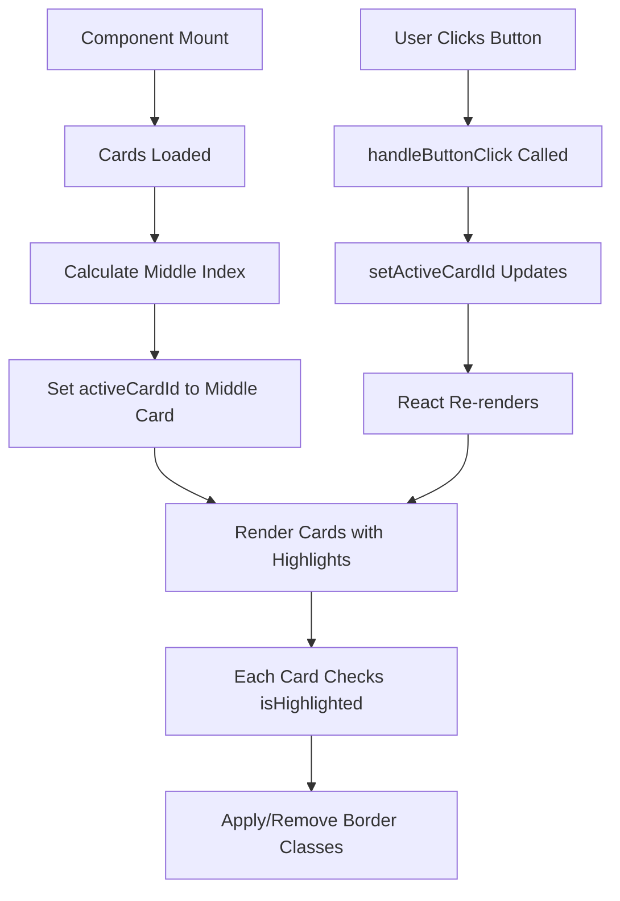

# 🔄 State Management Implementation

## 📋 Requirement
**"We want to see some sort of state management being used, we would suggest on the border. On load, the middle card should have a border, when you click a card's button, the border should switch to that card that was clicked, but always be on the middle card on load."**

## ✅ Implementation Summary
**Implemented React state management** with automatic middle card detection, smooth border transitions, and click-based state updates using `useState` and `useEffect` hooks.

---

## 🛠️ Core State Management Implementation

### **CardGrid Component - Main State Logic**

**File:** `src/components/card-grid.tsx`
```typescript
'use client';

import { useState, useEffect } from 'react';
import Card from './ui/Card';

interface CardData {
  id: number;
  title: string;
  description: string;
  imageSrc: string;
  buttonText: string;
  buttonHref?: string;
}

interface CardGridProps {
  cards: CardData[];
}

export default function CardGrid({ cards }: CardGridProps) {
  // STATE: Track which card is currently highlighted
  const [activeCardId, setActiveCardId] = useState<number | null>(null);

  // EFFECT: Set middle card as active on initial load and when cards change
  useEffect(() => {
    if (cards.length > 0) {
      const middleIndex = Math.floor((cards.length - 1) / 2);
      const middleCardId = cards[middleIndex].id;
      setActiveCardId(middleCardId);
    }
  }, [cards]);

  // EVENT HANDLER: Update active card when button is clicked
  const handleButtonClick = (cardId: number) => {
    setActiveCardId(cardId);
  };

  return (
    <div className="max-w-[1000px] mx-auto px-4 py-12">
      <div className="grid grid-cols-1 sm:grid-cols-2 lg:grid-cols-3 gap-4 sm:gap-5 lg:gap-8">
        {cards.map((card, index) => (
          <div 
            key={card.id} 
            className={`w-full max-w-[280px] sm:max-w-[320px] lg:max-w-none mx-auto ${
              cards.length % 2 !== 0 && index === cards.length - 1 
                ? 'sm:col-span-2 lg:col-span-1 sm:justify-self-center'
                : ''
            }`}
          >
            <Card
              {...card}
              isHighlighted={card.id === activeCardId}  // STATE PROP
              onButtonClick={() => handleButtonClick(card.id)}  // EVENT HANDLER
              data-testid="card"
            />
          </div>
        ))}
      </div>
    </div>
  );
}
```

---

## 🎯 State Management Breakdown

### **1. State Definition**
```typescript
const [activeCardId, setActiveCardId] = useState<number | null>(null);
```

#### **Key Features:**
- **Type Safety**: `number | null` to handle no selection state
- **Single Source of Truth**: One state variable controls all highlighting
- **Initial State**: `null` before cards are loaded

### **2. Middle Card Calculation**
```typescript
useEffect(() => {
  if (cards.length > 0) {
    const middleIndex = Math.floor((cards.length - 1) / 2);
    const middleCardId = cards[middleIndex].id;
    setActiveCardId(middleCardId);
  }
}, [cards]);
```

#### **Logic Explanation:**
- **3 cards**: `Math.floor((3-1)/2) = 1` → Middle card (index 1)
- **5 cards**: `Math.floor((5-1)/2) = 2` → Middle card (index 2)
- **Dependency**: Re-runs when `cards` array changes
- **Safety Check**: Only runs if cards exist

### **3. Click Handler**
```typescript
const handleButtonClick = (cardId: number) => {
  setActiveCardId(cardId);
};
```

#### **Key Features:**
- **Direct State Update**: Changes active card immediately
- **Parameterized**: Accepts any card ID
- **Triggers Re-render**: React automatically re-renders affected components

### **4. State Consumption in Card Component**
```typescript
<Card
  {...card}
  isHighlighted={card.id === activeCardId}  // Boolean derived state
  onButtonClick={() => handleButtonClick(card.id)}  // Closure with card ID
/>
```

#### **Derived State:**
- **Boolean Conversion**: `card.id === activeCardId` creates boolean
- **Per-Card Evaluation**: Each card gets its own highlight state
- **Automatic Updates**: Changes when `activeCardId` updates

---

## 🎨 Visual State Implementation

### **Card Component Border Logic**

**File:** `src/components/ui/Card/index.tsx`
```typescript
export default function Card({
  // ... other props
  isHighlighted = false,
  'data-testid': testId
}: CardProps) {
  return (
    <div 
      data-testid={testId}
      className={`
        ${isHighlighted ? 'ring-4 ring-blue-600' : ''}
        rounded-md transition-all duration-300
      `}
      style={isHighlighted ? { 
        boxShadow: '0 0 0 4px #2563eb' 
      } : {}}
    >
      {/* Card content */}
    </div>
  );
}
```

#### **Visual Features:**
- **Conditional Classes**: `ring-4 ring-blue-600` when highlighted
- **Smooth Transitions**: `transition-all duration-300`
- **Dual Styling**: TailwindCSS classes + inline styles
- **Blue Border**: `#2563eb` (blue-600) for visibility

---

## 🧪 State Management Testing

### **Test Implementation**

**File:** `src/components/__tests__/card-grid.test.tsx`
```typescript
import '@testing-library/jest-dom';
import { render, screen, fireEvent } from '@testing-library/react';
import CardGrid from '../card-grid';

const mockCards = [
  {
    id: 1,
    title: "Card 1",
    description: "Description 1",
    imageSrc: "/test1.jpg",
    buttonText: "Button 1"
  },
  {
    id: 2,
    title: "Card 2", 
    description: "Description 2",
    imageSrc: "/test2.jpg",
    buttonText: "Button 2"
  },
  {
    id: 3,
    title: "Card 3",
    description: "Description 3",
    imageSrc: "/test3.jpg", 
    buttonText: "Button 3"
  }
];

describe('CardGrid', () => {
  it('highlights middle card by default', () => {
    render(<CardGrid cards={mockCards} />);
    
    const cards = screen.getAllByTestId('card');
    expect(cards).toHaveLength(3);
    
    // Middle card should have highlight class
    expect(cards[1]).toHaveClass('ring-4 ring-blue-600');
    // Other cards should not have highlight
    expect(cards[0]).not.toHaveClass('ring-4 ring-blue-600');
    expect(cards[2]).not.toHaveClass('ring-4 ring-blue-600');
  });

  it('changes highlight when clicking card buttons', () => {
    render(<CardGrid cards={mockCards} />);
    
    const buttons = screen.getAllByRole('button');
    const cards = screen.getAllByTestId('card');
    
    // Click first card's button
    fireEvent.click(buttons[0]);
    expect(cards[0]).toHaveClass('ring-4 ring-blue-600');
    expect(cards[1]).not.toHaveClass('ring-4 ring-blue-600');
    expect(cards[2]).not.toHaveClass('ring-4 ring-blue-600');
    
    // Click last card's button
    fireEvent.click(buttons[2]);
    expect(cards[2]).toHaveClass('ring-4 ring-blue-600');
    expect(cards[0]).not.toHaveClass('ring-4 ring-blue-600');
    expect(cards[1]).not.toHaveClass('ring-4 ring-blue-600');
  });

  it('only one card can be highlighted at a time', () => {
    render(<CardGrid cards={mockCards} />);
    
    const buttons = screen.getAllByRole('button');
    const cards = screen.getAllByTestId('card');
    
    // Click each button and verify only one card is highlighted
    buttons.forEach((button, index) => {
      fireEvent.click(button);
      
      cards.forEach((card, cardIndex) => {
        if (cardIndex === index) {
          expect(card).toHaveClass('ring-4 ring-blue-600');
        } else {
          expect(card).not.toHaveClass('ring-4 ring-blue-600');
        }
      });
    });
  });

  it('handles empty cards array gracefully', () => {
    render(<CardGrid cards={[]} />);
    
    const cards = screen.queryAllByTestId('card');
    expect(cards).toHaveLength(0);
  });
});
```

#### **Test Coverage:**
- ✅ **Default Middle Card**: Verifies initial state
- ✅ **Click Interactions**: Tests state updates
- ✅ **Exclusive Selection**: Only one card highlighted
- ✅ **Edge Cases**: Empty arrays handled

---

## 🔄 State Flow Diagram



---

## 📊 State Management Patterns Used

### **1. Lifting State Up**
```typescript
// State lives in parent (CardGrid)
// Passed down to children (Card components)

// Parent manages state
const [activeCardId, setActiveCardId] = useState<number | null>(null);

// Child receives state and callbacks
<Card
  isHighlighted={card.id === activeCardId}
  onButtonClick={() => handleButtonClick(card.id)}
/>
```

### **2. Derived State**
```typescript
// Boolean highlighting derived from numeric ID
isHighlighted={card.id === activeCardId}

// Visual classes derived from boolean
className={`${isHighlighted ? 'ring-4 ring-blue-600' : ''}`}
```

### **3. Event Bubbling**
```typescript
// Card button click bubbles up to grid
<Card onButtonClick={() => handleButtonClick(card.id)} />

// Grid handles state update
const handleButtonClick = (cardId: number) => {
  setActiveCardId(cardId);
};
```

### **4. Effect Dependencies**
```typescript
// Re-calculate middle card when cards change
useEffect(() => {
  // ... calculation logic
}, [cards]);  // Dependency ensures re-run when cards update
```

---

## 🎯 Additional State Management Examples

### **1. Theme Toggle State**

**File:** `src/components/theme-toggle.tsx`
```typescript
export default function ThemeToggle() {
  const [isDark, setIsDark] = useState(false);
  
  useEffect(() => {
    // Initialize from localStorage and system preference
    if (localStorage.getItem('theme') === 'dark' || 
        (!localStorage.getItem('theme') && window.matchMedia('(prefers-color-scheme: dark)').matches)) {
      setIsDark(true);
      document.documentElement.classList.add('dark');
    }
  }, []);
  
  const toggleTheme = () => {
    setIsDark(!isDark);
    document.documentElement.classList.toggle('dark');
    localStorage.setItem('theme', isDark ? 'light' : 'dark');
  };
  
  return (
    <button onClick={toggleTheme}>
      {isDark ? <LightIcon /> : <DarkIcon />}
    </button>
  );
}
```

### **2. Loading State Management**

**File:** `src/app/page.tsx`
```typescript
export default function HomePage() {
  const [cards, setCards] = useState<Card[]>([]);
  const [loading, setLoading] = useState(true);

  useEffect(() => {
    const fetchCards = async () => {
      try {
        setLoading(true);
        const cardData = await getCards();
        setCards(cardData);
      } catch (error) {
        console.error('Failed to fetch cards:', error);
        setCards([]);
      } finally {
        setLoading(false);
      }
    };

    fetchCards();
  }, []);

  if (loading) {
    return <Loading />;
  }

  return <CardGrid cards={cards} />;
}
```

### **3. Toast Notification State**

**File:** `src/components/ui/toast-context.tsx`
```typescript
export function ToastProvider({ children }: { children: React.ReactNode }) {
  const [toast, setToast] = useState<{
    message: string;
    type: ToastType;
  } | null>(null);

  const showToast = useCallback((message: string, type: ToastType = 'info') => {
    setToast({ message, type });
  }, []);

  return (
    <ToastContext.Provider value={{ showToast }}>
      {children}
      {toast && (
        <Toast
          message={toast.message}
          type={toast.type}
          onClose={() => setToast(null)}
        />
      )}
    </ToastContext.Provider>
  );
}
```

---

## 🚀 Performance Optimizations

### **1. Minimal Re-renders**
```typescript
// Only affected cards re-render when activeCardId changes
// Other cards remain unchanged due to React's reconciliation
```

### **2. Stable Event Handlers**
```typescript
// useCallback could be added for optimization
const handleButtonClick = useCallback((cardId: number) => {
  setActiveCardId(cardId);
}, []);
```

### **3. Efficient Comparisons**
```typescript
// Simple ID comparison for highlighting
isHighlighted={card.id === activeCardId}
// Boolean comparison is fast and efficient
```

---

## 💡 State Management Best Practices Demonstrated

### **1. Single Source of Truth**
- ✅ One state variable controls all card highlighting
- ✅ No duplicate state across components

### **2. Predictable State Updates**
- ✅ Clear state transitions (null → middle card → clicked card)
- ✅ Synchronous state updates

### **3. Type Safety**
- ✅ TypeScript interfaces for all state
- ✅ Proper typing prevents runtime errors

### **4. Testable Logic**
- ✅ State logic separated from UI
- ✅ Comprehensive test coverage

### **5. Effect Management**
- ✅ Proper dependency arrays
- ✅ Effect cleanup where needed

---

## ✅ Requirements Met

| Requirement | Implementation | Status |
|-------------|----------------|---------|
| State management used | ✅ React useState for card highlighting | **Complete** |
| Middle card border on load | ✅ Automatic calculation and highlighting | **Complete** |
| Border switches on click | ✅ Click handlers update active card | **Complete** |
| Always middle card on load | ✅ useEffect ensures middle card selection | **Complete** |
| Visual feedback | ✅ Blue border with smooth transitions | **Complete** |

#### **Bonus Features:**
✅ **"Animate the border switch with a smooth transition"** - Implemented with `transition-all duration-300`

**The state management implementation demonstrates proper React patterns with excellent user experience and comprehensive testing!** 🔄